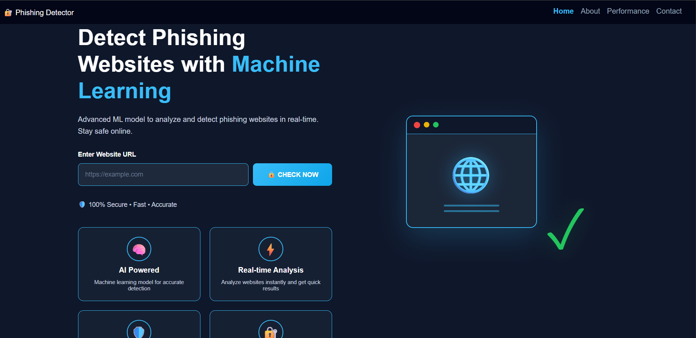
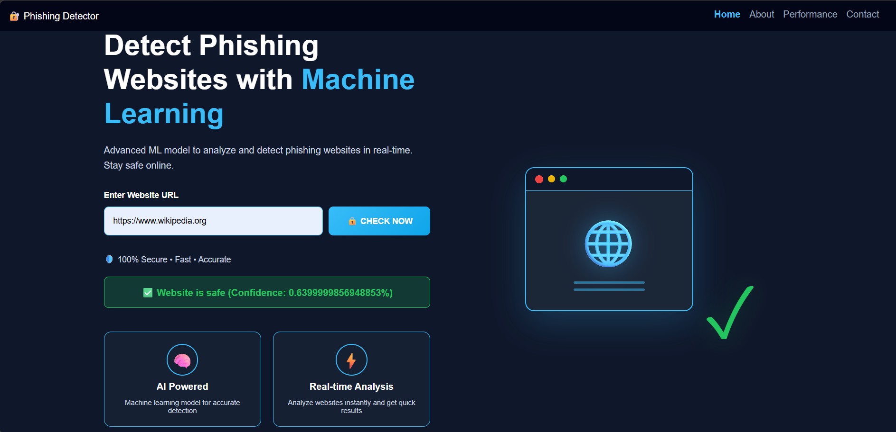

# 🔐 AI Phishing URL Detector

An intelligent **Machine Learning-based web application** that detects whether a given URL is **safe or phishing (malicious)** using feature extraction and classification techniques.

---

## 🚀 Features

* 🔍 Detects phishing and legitimate URLs
* 🤖 Machine Learning-based prediction
* ⚡ Real-time analysis
* 📊 Confidence score display
* 🖥️ User-friendly web interface

---

## 🧠 Tech Stack

* **Python**
* **Machine Learning (Scikit-learn)**
* **FastAPI / Flask (Backend)**
* **HTML, CSS (Frontend)**

---

## 📸 Screenshots

### 🏠 Home Page

A clean and modern interface for entering URLs and detecting phishing websites in real-time.



---

### ✅ Safe URL Detection

The system correctly identifies legitimate websites with a confidence score.



---

### ⚠️ Phishing URL Detection

Example: `http://sbi-verification-update.com`
The system warns users when a malicious/phishing website is detected.


---

## 📂 Project Structure

```
ai-phishing-detector/
│
├── main.py
├── train_2.py
├── model.pkl
├── final_test (2).csv
│
├── templates/
│   └── index.html
│
├── static/
│   └── style.css
│
├── images/
│   ├── home.png
│   ├── safe.png
│   └── phishing.png
│
└── README.md
```

---

## ⚙️ How to Run

### 1️⃣ Clone the repository

```
git clone https://github.com/Gopal-goswami/ai-phishing-detector.git
cd ai-phishing-detector
```

### 2️⃣ Install dependencies

```
pip install -r requirements.txt
```

### 3️⃣ Run the server

```
uvicorn main:app --reload
```

### 4️⃣ Open in browser

```
http://127.0.0.1:8000
```

---

## 🎯 Use Case

* Detect phishing websites
* Improve cybersecurity awareness
* Prevent users from malicious attacks

---

## 👨‍💻 Author

**Gopal Goswami**
GitHub: https://github.com/Gopal-goswami

---

## ⭐ Support

If you found this project useful, please ⭐ the repository!
